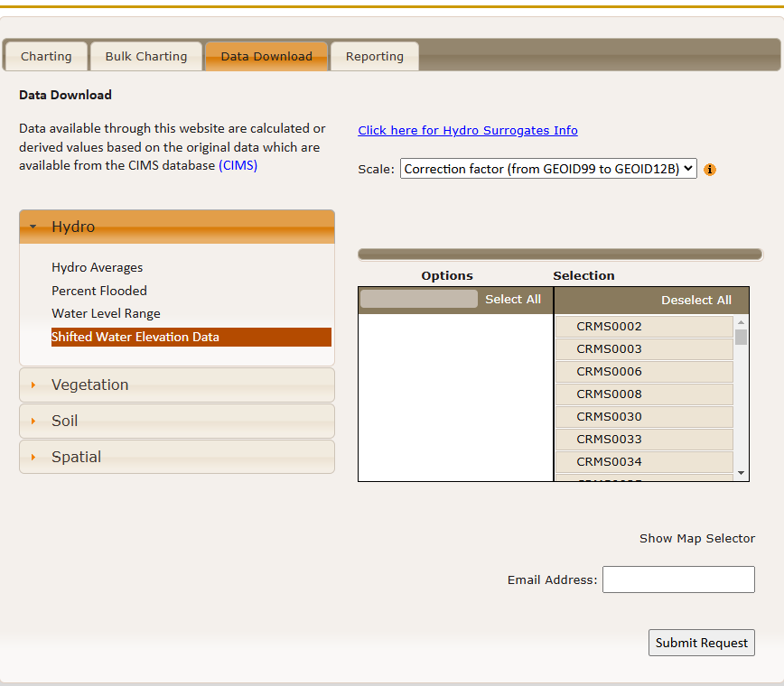
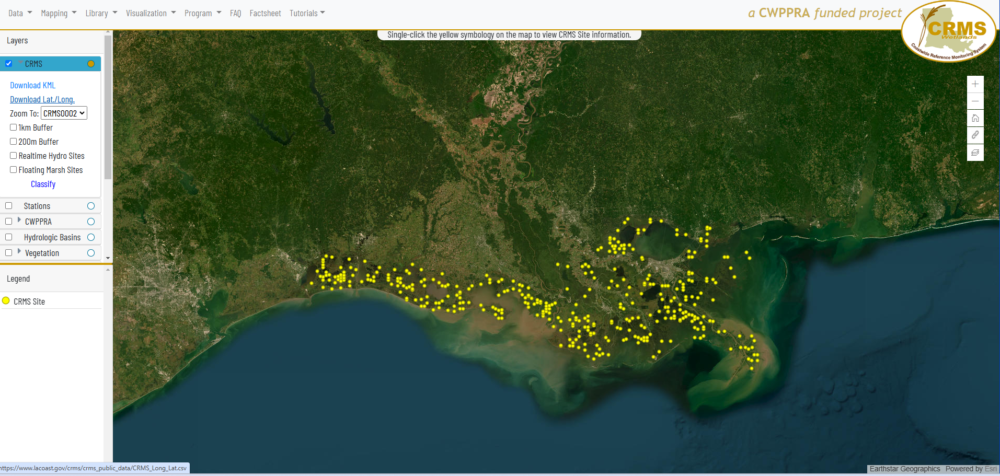
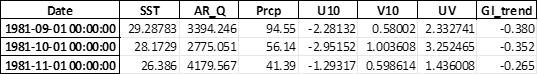

CRMS2Map documentation
======================
**Last Modify 01/09/25**

.. _introduction:

**Introduction**
----------------
CRMS2Map: Data analytical and mapping tools for the Louisiana Coastal
Reference Monitoring System (CRMS)

Repository: https://github.com/jinikeda/crms2map

.. _environment_setting:

**Environment Setting**
-----------------------

See, 
https://github.com/jinikeda/crms2map/env.yml

**Installation**
----------------
-  **CRMS2Map**:

   -  Clone the repository from GitHub:

      -  git clone
   
   -  Install the required packages:

      - conda env create -f env.yml

   -  Activate the environment:
   
      - conda activate CRMS_env
   

**Datasets**
------------

Available data list https://cims.coastal.la.gov/monitoring-data/

Bulk downloads: https://cims.coastal.la.gov/FullTableExports.aspx

CRMS data list

-  Hydrographic Data (Continuous Hydrographic (Hourly), Discrete
   Hydrographic (Monthly)) using bulk download links

-  Coastal Basin (GIS data -> Reference layers -> **Basins**)

..

   Input/Basin_NAD83.shp (ten coastal domains defined by CPRA)

   Input/Basin_NAD83_Dissolve.shp (merged single domain)

-  Datum conversion for surface water elevation (**Geoid12B** after Oct
   2, 2023. No more Geoid12A data are available)

..

   https://www.lacoast.gov/chart/Charting.aspx?laf=crms&tab=2

   Figure Geoid12B Datum Conversion

**Usage**
---------
**CRMS2 Map package: Features and Workflow**

**1. Auto-Retrieve Hydrographic Data**
~~~~~~~~~~~~~~~~~~~~~~~~~~~~~~~~~~~~~~

-  **CRMS2Map continuous**:

   -  Retrieves and subsets continuous hydrographic data (hourly).

   -  Estimated Time: 10 – 20 minutes.

-  **CRMS2Map discrete**:

   -  Retrieves and subsets discrete hydrographic data (monthly).

   -  Estimated Time: ~1 minute.

**2. Data Processing of Hydrographic Data**
~~~~~~~~~~~~~~~~~~~~~~~~~~~~~~~~~~~~~~~~~~~

-  **CRMS2Map resample**:

   -  Generates averaged datasets (hourly, daily, monthly, yearly) from
      continuous and discrete hydrographic data.

   -  Processed datasets are saved in the “Input” folder.

   -  Processed and output data are organized in their respective
      folders for easy access.

   -  Estimated Time: ~3 minutes.

**3. Data Visualization of Hydrographic Data**
~~~~~~~~~~~~~~~~~~~~~~~~~~~~~~~~~~~~~~~~~~~~~~

-  **CRMS2Map plot**:

   -  Creates time-series plots for the user’s specified period.

   -  Includes (moving-averaged) datasets for:

      -  Salinity [ppt]

      -  Water level [m, NAVD88]

      -  Percent time inundation/Hydro period [-]

      -  Inundation depth [m]

   -  **Station Specification**:

      -  When the user wants to specify the station(s), of interest,
         update the station_list.txt file located in the parent folder.

   -  **Estimated Time**: ~2 minutes.

   option

   | --sdate State date for the data analysis (format: YYYY-MM-DD)
     [Default: "2008-01-01"]
   | --edate End date for the data analysis (format:
     YYYY-MM-DD)[Default: "2024-12-31"]
   | --staionfile Path to station list file <station_list.txt> (format:
     CRMSxxxx)[Default: None]
   | --data_type Data type: hourly(H), daily(D), monthly(M), and
     yearly(Y)[Default: M]
   | --save Save as a single (bundled) dataset and MA_datasets. This is
     time-consuming when the user uses high spatial datasets. [Default:
     True]
   | --plotdata Plot original data (org) or moving average data
     (MA)[Default: MA]
   | --specify_ma [Optional] The user can specify a central moving
     average window size in days. [Default: yearly averaged]

**CRMS2Map Pytest**
-------------------

-  .. rubric:: tests/test_CRMS_general_functions.py
      :name: teststest_crms_general_functions.py

.. raw:: html

   <!-- -->

-  Test individual functions used in each submodule (Github Action
   automatically tests the CI/CD pipeline when changing the code).

**Supplement Analysis**
=======================

(folder: CRMS2Map/Supplement)

**Datasets**
------------

- **CRMS station coordinates**

..

   CRMS_Long_Lat.csv

   https://www.lacoast.gov/crms_viewer/Map/CRMSViewer -> Download
   Lat./Long.

   Figure CRMS Viewer to download Lat/Long data on CRMS stations.

-  **Marsh Vegetation**

..

   (https://cims.coastal.la.gov/FullTableExports.aspx -> Full Table
   Exports - CRMS Data Only -> **Marsh Vegetation**)

   Processed CRMS_Long_Lat.csv and CRMS_Marsh_Vegetation.csv to make
   dominant marsh vegetation types and the station’s coastal domains.

-  Location: Data/CRMS_station_Basin_Community.shp

.. raw:: html

   <!-- -->

-  **Station list for each variable** (Surface_salinity, water
   elevation, temperature, etc)

.. raw:: html

   <!-- -->

-  Data/CRMS_stations_Surface_salinity.shp

-  Data/CRMS_stations_Water_Elevation_to_Datum.shp

-  Data/CRMS_stations_Water_Elevation_to_Marsh.shp

-  Data/CRMS_stations_Water_Temp.shp

.. raw:: html

   <!-- -->

-  **Median monthly climate drivers** (sea surface temperature, river
   flow, precipitation, winds) in Coastal Louisiana (Processed data)

.. raw:: html

   <!-- -->

-  Locations: Data/MonthlySST.xlsx

..

   |image3|

   Subdomain/community analysis:

-  Data/AR_daily_discharge_since_1970.csv (daily Atchafalaya River
   discharge)

-  Data/CS_discharge_since_2008.csv (daily Calcasieu River discharge)

-  Data/Basin_total_prcp Monthly.xlsx (total precipitation in each
   basin)

For the detailed datasets list, please refer to Table2 on
*“Tempo-spatial variations in water level and salinity in Louisiana
coastal wetlands over 15 years”*

**1. Function of Monthly_analysis_practice.py**
~~~~~~~~~~~~~~~~~~~~~~~~~~~~~~~~~~~~~~~~~~~~~~~

-  Data Reading and Preparation

   -  Read monthly continuous and discrete hydrographic datasets.

-  Data Analysis

   -  Generate 12-month moving average datasets.

   -  Examine short- (15 years) and long-term (over 40 years) trends for
      climate driver and CRMS data.

-  Data Grouping

   -  Grouped by subdomain and vegetation datasets.

-  Data Visualization

   -  Generates visualizations for subdomain and vegetation-specific
      datasets.

-  Statistical Analysis

   -  Analyzes correlations between subdomain/vegetation datasets and
      climate drivers.

..

   **Outputs**:

-  Plots for subdomains and vegetation datasets (e.g., Photo folder).

-  Display/output statistical results (e.g., Sub_basin/Sub_marsh >
   folders).

**2. Function of Bootstrap_Regression_analysis.py**
~~~~~~~~~~~~~~~~~~~~~~~~~~~~~~~~~~~~~~~~~~~~~~~~~~~

-  Multiple regression models

   -  Automated bootstrap regression analysis using ordinal linear and
      random forest models.

-  Statistical Analysis

   -  Evaluate the performance of models.

..

   **Outputs**:

-  Statistical results (e.g. bootstrap_Output folder).

**3. Function of Regression_analysis_plot.py**
~~~~~~~~~~~~~~~~~~~~~~~~~~~~~~~~~~~~~~~~~~~~~~

-  Data Visualization

   -  Generates a time series of visualizations for each subdomain.

-  Statistical Analysis

   -  Generates a summary table of model performance for each subdomain.

..

   **Outputs**:

-  Plot a time series of model predictions and comparisons (Photo >
   folder).

-  Generate model performance and statistical results >
   (bootstrap_Output folder).

